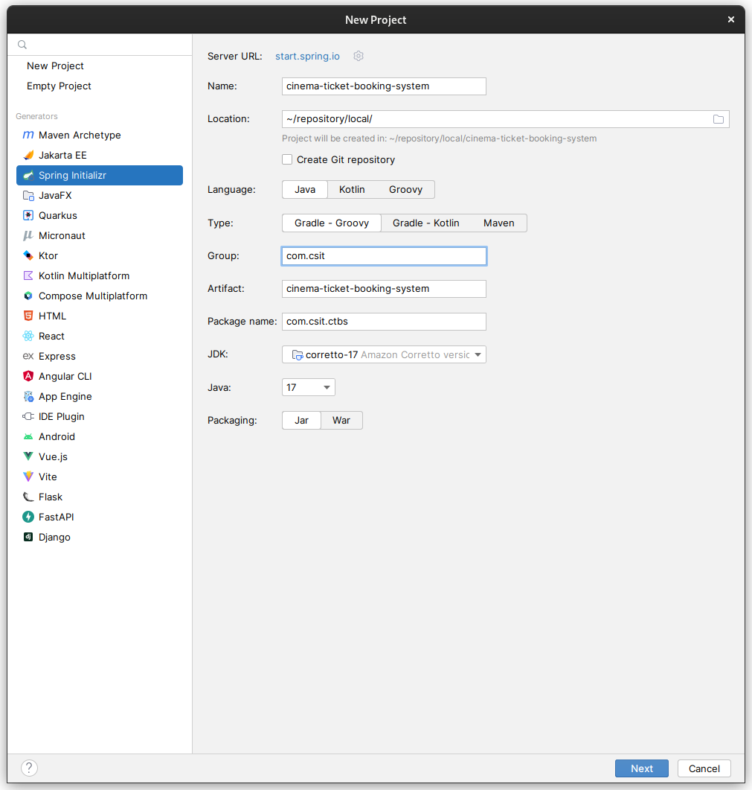
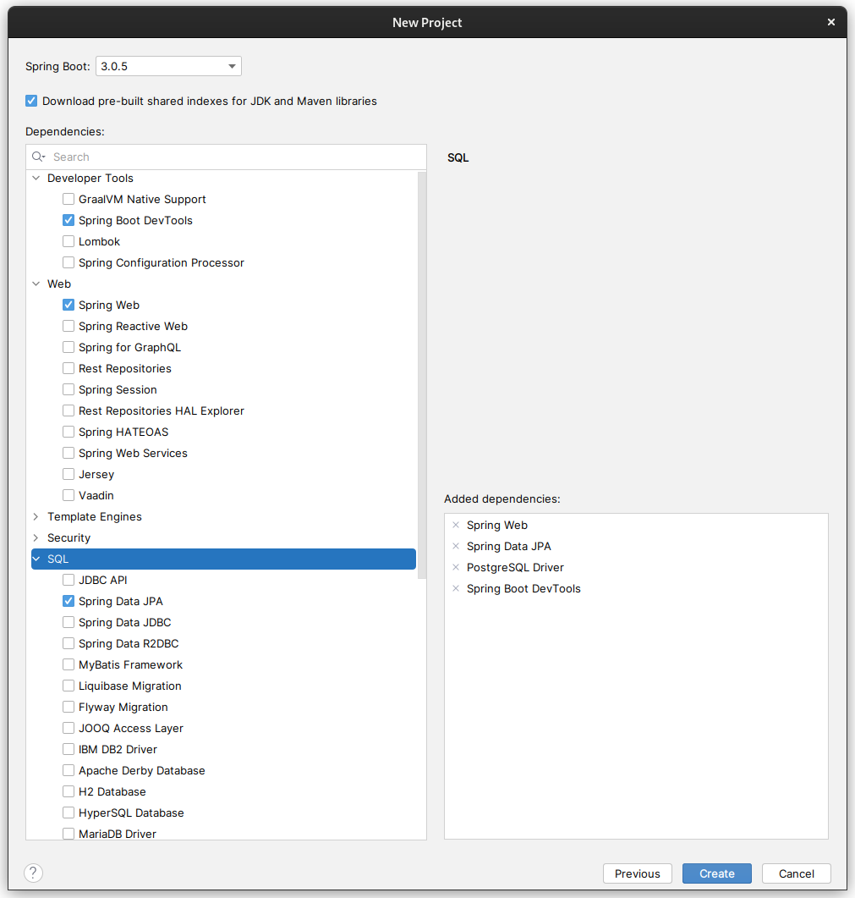
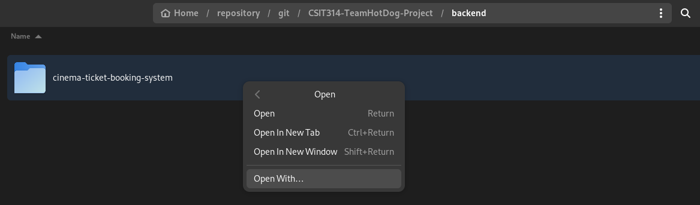
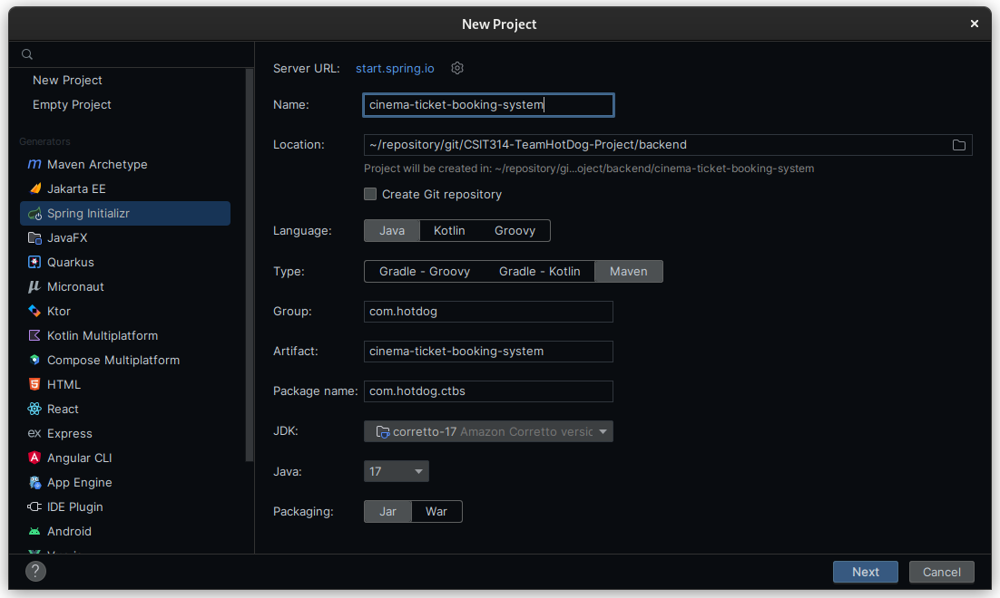
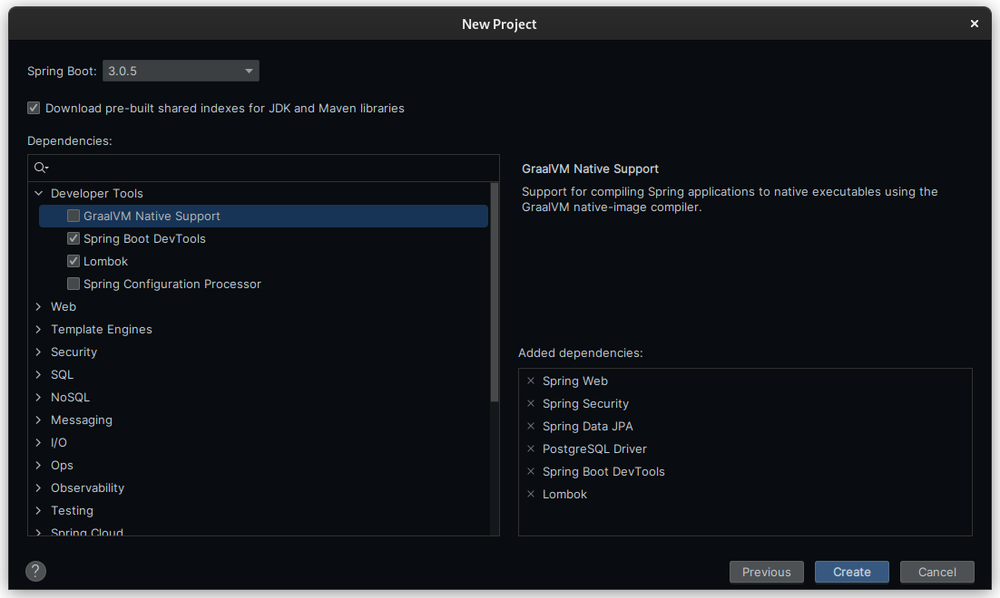

# IntelliJ

<!-- TOC -->
* [IntelliJ](#intellij)
  * [Guide for JDK 17](#guide-for-jdk-17)
  * [Guide for Spring Boot](#guide-for-spring-boot)
    * [Start a new project](#start-a-new-project)
    * [Add dependencies](#add-dependencies)
<!-- TOC -->

## Guide for JDK 17

If JDK is not installed, run `winget` on Windows:

```powershell
winget install -e --id Amazon.Corretto.17
```

If winget is not installed, [download winget](https://aka.ms/getwinget).
Open the `.msixbundle` file, which will prompt an installation of winget.

## Guide for Spring Boot, for Practice

### Start a new project




Follow exactly the same configuration as above. \
This is done in IntelliJ.

### Add dependencies



### Review directory structure


The directory structure should follow the screenshot above.
If everything looks OK, you can start .

## Guide for Spring Boot, for this Project

Clone the repository, and **Open the folder With** IntelliJ:



Do not open the folder at the root directory, i.e. "CSIT-314-TeamHotDog-Project".

### Backend configuration

This project uses Maven, with JDK 17:



This project has 6 added dependencies (see image below):



This documentation is a work in progress.