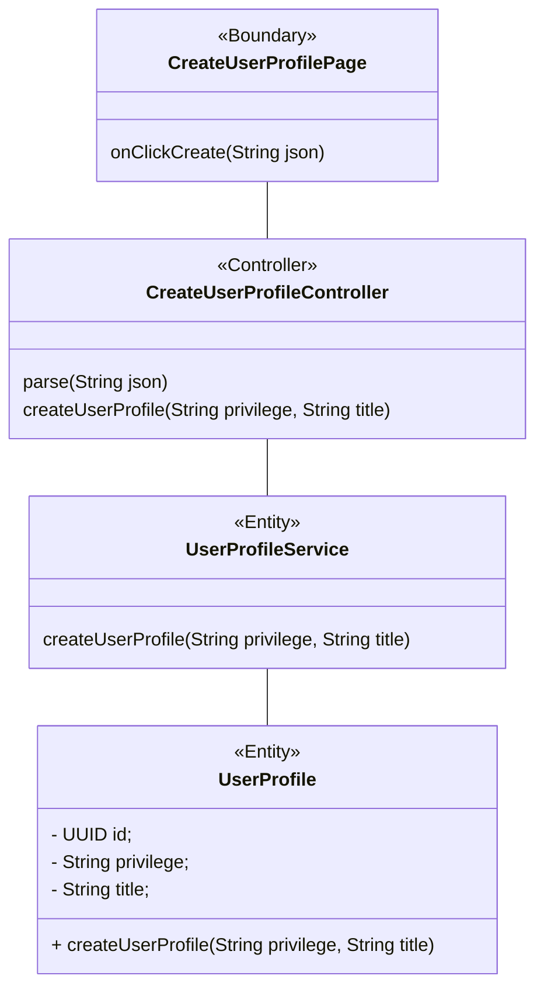
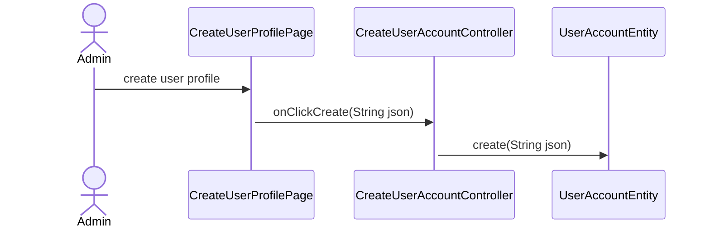
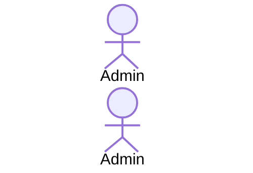

As a user admin, I want to be able to create user profile so that I allocate user profile to user account.

Taiga ID: [#11](https://tree.taiga.io/project/isaacsimstudy-sim2023q2-hotdogbun-1/us/11)

## BCE Diagram

## Sequence Diagram

### Default flow

### Alternate flows: Invalid information

