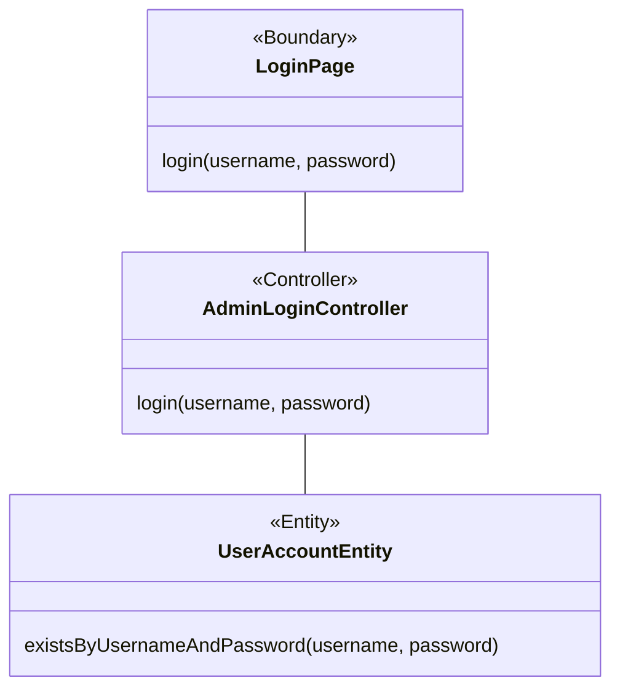
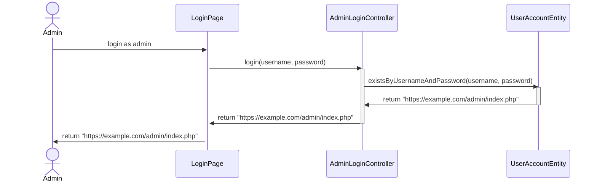
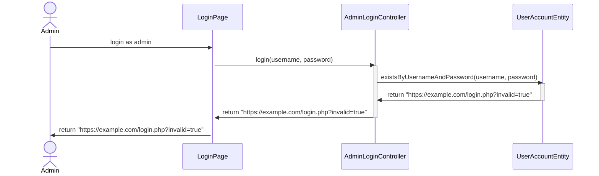

As an admin, I want to be able to log in and logout.

Taiga ID: #1

## BCE Diagram

```mermaid
classDiagram
class AdminLoginController {
    <<Controller>>
    login(username, password)
}
class UserAccountEntity {
    <<Entity>>
    existsByUsernameAndPassword(username, password)
}
class LoginPage {
    <<Boundary>>
    login(username, password)
}
AdminLoginController -- UserAccountEntity
LoginPage -- AdminLoginController
```

## Sequence Diagram

### Default flow

```mermaid
sequenceDiagram
actor Admin
Admin ->> LoginPage : login as admin
activate LoginPage
LoginPage ->> AdminLoginController : login(username, password)
activate AdminLoginController
AdminLoginController ->> UserAccountEntity : existsByUsernameAndPassword(username, password)
activate UserAccountEntity
UserAccountEntity ->> AdminLoginController : return "https://example.com/admin/index.php"
deactivate UserAccountEntity
AdminLoginController ->> LoginPage : return "https://example.com/admin/index.php"
deactivate AdminLoginController
LoginPage ->> Admin : return "https://example.com/admin/index.php"
```

### Alternate flows: Invalid login

```mermaid
sequenceDiagram
actor Admin
Admin ->> LoginPage : login as admin
activate LoginPage
LoginPage ->> AdminLoginController : login(username, password)
activate AdminLoginController
AdminLoginController ->> UserAccountEntity : existsByUsernameAndPassword(username, password)
activate UserAccountEntity
UserAccountEntity ->> AdminLoginController : return "https://example.com/login.php?invalid=true"
deactivate UserAccountEntity
AdminLoginController ->> LoginPage : return "https://example.com/login.php?invalid=true"
deactivate AdminLoginController
LoginPage ->> Admin : return "https://example.com/login.php?invalid=true"
```

